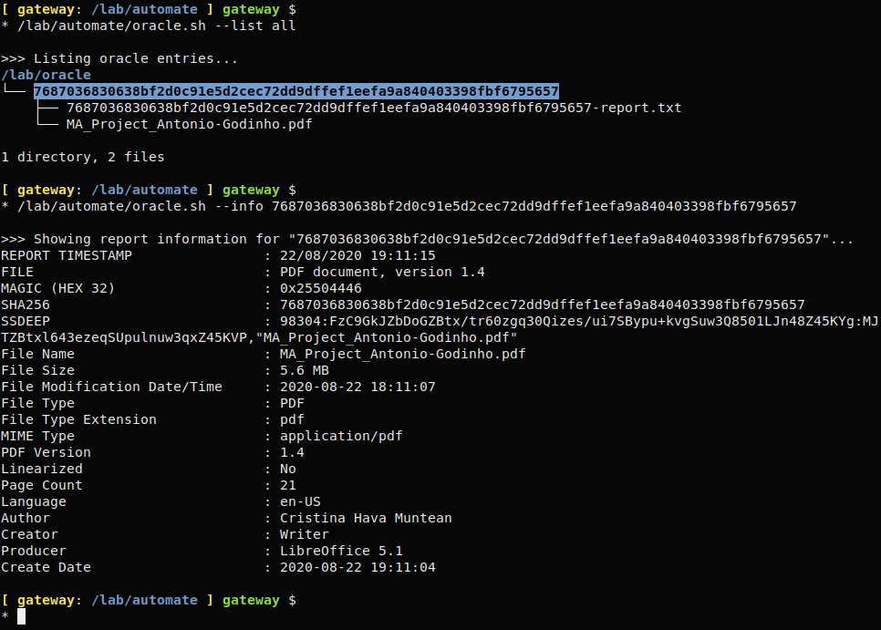

# ma-oracle

A simple Malware Analysis oracle tool to help store malicious files in a nice & tidy way! Supports compressed files, extracting the files from the archives and storing them according to their unique SHA signature.

*Tired of finding forgotten malware files scattered around your file system? Worry no more, here is a simple oracle written in bash to help you keep your malicious files sorted all nice & tidy.*

**Screenshot:**

**Uses the following tools:**

 - tree
 - xxd 
 - sha256sum
 - file
 - ssdeep
 - exiftool
 - unzip
 - unrar
 - 7za

**Ubuntu installation:** sudo apt install exif-tool tree ssdeep p7zip unzip unrar

**Parameters:**

--file    [NAME]    : Process file NAME

--list    [ALL]     : List ALL oracle entries

--list    [SHA-256] : List entry with SHA-256

--search  [VALUE]   : Search for VALUE in oracle

--report  [SHA-256] : Show report information for entry with SHA-256

--mods    [ALL]     : Print a list of ALL locations/files where modifications (ordered descending by date/time) occured

--mods    [LAST]    : Print the location/file where the LAST modification occured in oracle

--mods    [SHA-256] : Print a list of locations/files where modifications occured in entry with SHA-256 (ordered descending by date/time)

--size    [ALL]     : Print disk size used by ALL oracle entries

--size    [SHA-256] : Print disk size used by entry SHA-256

--delete  [SHA-256] : Delete entry with SHA-256

**Directories paths:**

Variable ORACLE="/lab/oracle" defines the oracle location where all files will be saved to